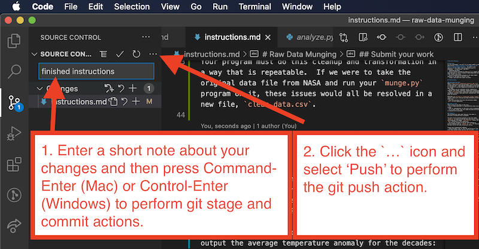

# Flask-MongoDB Web App

In this assignment you will create a web app that relies upon a MongoDB database.

## Example app

An example web app has been included in this repository for your reference - see [how to setup and run that example web app](./setup.md).

## Getting started

It is **highly** recommended that you start by [setting up the example app](./setup.md). Get this example up-and-running before modifying the code in any way.

To speed up development, you may want to have two copies of the example app running: one locally on your own computer and one on the **i6** web server. The example app setup instructions contain some guidance for setting up both remote and local instances of the app.

## Requirements

### Basic requirements

You will create a web app that must...

1. be written in Python, using [flask](https://flask.palletsprojects.com/en/1.1.x/) and [pymongo](https://pymongo.readthedocs.io/en/stable/index.html).
1. be deployed (i.e. published) to NYU CS Department's web server and MongoDB server, `i6.cims.nyu.edu` and `class-mongodb.cims.nyu.edu`, respectively.
1. allow the user to interact with data from the database in an intuitive and effortless manner, not requiring the user to understand any technical details of computer programming or databases.
1. involve each of the basic operations of **CRUD** on documents in the database, triggered by user interactions.
1. be well-designed with a clear consistency of design from one web page to the next.
1. represent an amount of effort appropriate for an assignment of this duration and number of developers.
1. do something useful and/or interesting.

### Advanced option

If you are interested in allowing users of your app to create accounts and log in, you may be interested in the [flask-login](https://pypi.org/project/Flask-Login/) module, which makes it relatively simple to allow users to create accounts, log in and out, and store user credentials in a database of your choosing.

### Documentation requirements

Delete the contents of the `README.md` file and replace with a well-written, nicely-formatted Markdown document describing your app. Include at least the following:

- the title of your app
- a simple description of your app
- a link to the deployed copy of your app
- the full names, NYU Net IDs, and links to GitHub accounts of any collaborators with whom you worked on this app

## Submit your work

Use Visual Studio Code to perform git `stage`, `commit` and `push` actions to submit. These actions are all available as menu items in Visual Studio Code's Source Control panel.

1. Type a short note about what you have done to the files in the `Message` area, and then type `Command-Enter` (Mac) or `Control-Enter` (Windows) to perform git `stage` and `commit` actions.
1. Click the `...` icon next to the words, "Source Control" and select "Push" to perform the git `push` action. This will upload your work to your repository on GitHub.com.

