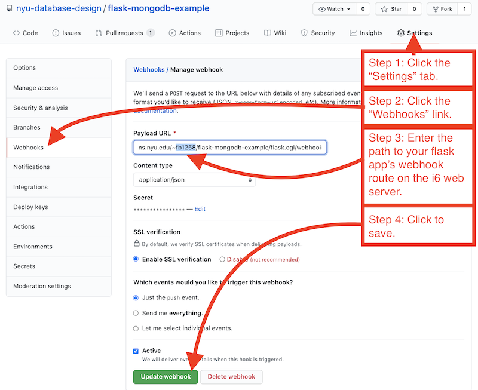

# Flask-MongoDB Example Web App

A simple example of a web app using [pymongo](https://pymongo.readthedocs.io/en/stable/index.html) to interact with a MongoDB database.

It is possible to run this app remotely or locally. Instructions are included for each.

## Run locally

To run this app locally, first clone this repository to your local machine...

`git clone url-to-this-repository`

... and then do the following:

## set up a free trial account on sentry.io

1. Create a free trial account on [sentry.io](https://sentry.io).
1. Create a new project on sentry.io.
1. Copy the `DSN` string from the sentry.io project settings page.  You will later paste into a filed named `.env` according to the instructions below.

Once the free trial ends, Sentry will suggest switching to a paid account... **there is no need to pay**.  You can continue to use the free account.

### pip

Note that most Python programs require the use of the package manager named `pip` - the default Python "package manager". A package manager is software that takes care of installing the correct version of any modules in the correct place for the current system you are running it on. It comes with most distributions of Python. On many machines, the Python 3-compatible version it is calld `pip3` and on others it is simply `pip`... on some either works. If you are unsure, try both in the commands where you see it mentioned.

### Set up a Python virtual environment

There are multiple ways to set up a Python virtual environment - a specific area of memory and disk space where you can install the dependencies and settings necessary to run a specific app in isolation from other apps on the same computer... here are instructions for using either `pipenv` or `venv`.

### Using pipenv

The ability to make virtual environemnts with [pipenv](https://pypi.org/project/pipenv/) is relatively easy, but it does not come pre-installed with Python. It must be installed.

Install `pipenv` using `pip`:

```
pip3 install pipenv
```

Activate it:

```
pipenv sync
pipenv shell
```

Your command line will now be running within a virtual environment.

The file named, `Pipfile` contains a list of dependencies - other Python modules that this app depends upon to run. These will have been automatically installed into the virtual environment by `pipenv` when you ran the command `pipenv shell`.

#### Using venv

If you refuse to use `pipenv` for some reason, you can use the more traditional [venv](https://docs.python.org/3/library/venv.html) instead. The ability to make virtual environments with`venv` comes included with standard Python distributions.

This command creates a new virtual environment with the name `.venv`:

```bash
python3 -m venv .venv
```

To activate the virtual environment named `.venv`...

On Mac:

```bash
source .venv/bin/activate
```

On Windows:

```bash
.venv\Scripts\activate.bat
```

The `pip` settings file named, `requirements.txt` contains a list of dependencies - other Python modules that this app depends upon to run.

To install the dependencies into the currently-active virtual environment, use `pip`:

```bash
pip3 install -r requirements.txt
```

### Set up a local MongoDB database server

If running this app locally, you will not be able to connect to the [NYU CS Department's MongoDB server](https://cims.nyu.edu/webapps/content/systems/userservices/databases/class-mongodb). So you must have your app connect to either a cloud hosted database server, such as [MongoDB Atlas](https://www.mongodb.com/cloud/atlas), or run a local database on your own machine using either a [Docker image](https://hub.docker.com/_/mongo/) or downloading and installing [MongoDB Community Server](https://www.mongodb.com/try/download/community) and run a local database server on your own machine.

See [more details](https://knowledge.kitchen/content/courses/database-design/slides/mongodb-setup/#17) about running a MongoDB server in each of these places.

### Run the app

1. define two environment variables from the command line: on Mac, use the commands: `export FLASK_APP=app.py` and `export FLASK_ENV=development`; on Windows, use `set FLASK_APP=app.py` and `set FLASK_ENV=development`.
1. copy the file named `env.example` into a new file named `.env`, and enter your own MongoDB database connection credentials and DSN string from sentry.io into that file where indicated.
1. start flask with `flask run` - this will output an address at which the app is running locally, e.g. https://127.0.0.1:5000. Visit that address in a web browser.
1. in some cases, the command `flask` will not be found when attempting `flask run`... you can alternatively launch it with `python3 -m flask run --host=0.0.0.0 --port=10000`.

## Host on a web server

The following steps outline how to host this application on NYU's **i6**.cims.nyu.edu web server. Other servers may vary.

1. Familiarize yourself with web hosting steps on a CIMS server from the link: https://cims.nyu.edu/webapps/content/systems/userservices/webhosting.
1. remotely log into the server using `ssh`.
1. navigate into your web server account's `public_html` directory using `cd public_html`.
1. clone this repository with `git clone url-to-this-repository`. This will create a sub-directory named after your repository. Note that this command may require you to enter your GitHub usernamen and password. You should enter a GitHub [Personal Access Token](https://docs.github.com/en/authentication/keeping-your-account-and-data-secure/creating-a-personal-access-token) in place of your password here. You can generate a personal access token from your GitHub account's `Settings` in the `Developer settings` page.
1. navigate into the sub-directory that was created by the clone operation with `cd flask-app-directory`. If you don't know the sub-directory name, run `ls` to see a list of all files and directories within the `public_html` directory.
1. copy the file named `env.example` into a new file named `.env` (using `cp env.example .env`).
1. edit the `.env` file using `emacs .env`, and enter your own MongoDB database connection credentials and DSN string from sentry.io into that file where indicated. Save the changes within emacs by typing `Control-x` then `Control-s`. Exit emacs by typing, `Control-x` then `Control-c`.
1. Make the files named `flask.cgi` executable by all with the command, `chmod a+x flask.cgi`. This allows it to be executed when a web browser requests it.
1. Your app should now be live on the web at https://i6.cims.nyu.edu/~$USER/$FLASK-APP-DIRECTORY/flask.cgi, where `$USER` is replaced with your own **i6** username and `$FLASK-APP-DIRECTORY` is replaced with the name of the sub-directory within `public_html` where your flask app code resides. Visit that address in your preferred web browser.

## Debugging

Debugging errors on web servers can be tricky, especially when you see errors in the web browser but no details of what went wrong.

## on the command line
Log into the command shell of the computer where you are running the application (either your local computer or the web server), and try to run the `app.py` file as a regular Python script, e.g. `python3 app.py`.  You will often see simple errors reported this way that you wouldn't otherwise see.

## on sentry.io
In the instructions, we have asked you to setup an account with sentry.io, a service that logs errors in a hosted web interface.  This may be very helpful in understanding errors that occur as you run your applications.
- By default, sentry.io will show errors in the `Issues` tab of its web interface and will email them to you as they occur.
- If loading your web app in a web browser shows an error, check the sentry.io `Issues` tab to see whether an error has been reported there.
- You can turn off the email notifications in their settings if you prefer not to receive them.

## Continuous deployment

While not required, it is possible to automatically update a copy of this web app anytime new changes to the code are pushed to GitHub. Such an automatic update of a deployed web app is known as "continuous deployment".

Each repository on GitHub has a set of Settings for Webhooks. In those settings, it is possible to enter a "Payload URL" - GitHub will automatically issue an HTTP POST request to any URL you place there. The example web app code has a route designed to accept a webhook request from GitHub. That route automatically perform a `git pull` operation on the app's source code repository to update the code each time such a webhook request occurs.



If attempting to test this webhook technique on a local instance of the web app, GitHub will not be able to make requests to your local machine. To solve this, is possible to use a tool such as [ngrok](https://ngrok.com/) to provide a public URL that forwards requests to your local machine. In such a scenario, with ngrok installed, you would set up ngrok to forward all HTTP requests to port `5000` of your local machine with the command, `ngrok http 5000`. Then enter the appropriate public ngrok address - something like `https://7ccd453a429f.ngrok.io/webhook/` - into the GitHub webhook "Payload URL" setting.
